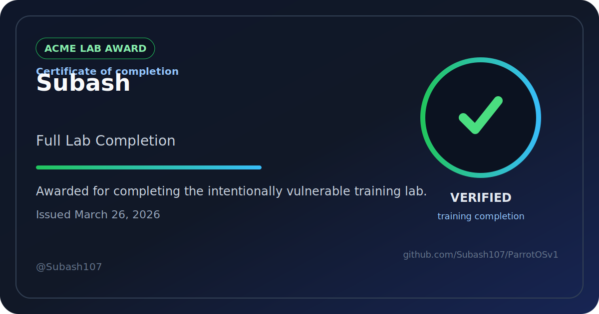

# ParrotOS Bug Hunting Local Lab

[](https://github.com/Subash107/ParrotOS/actions/workflows/security-lab.yml)
[](#quick-start)
[](#repository-layout)
[](#safety-note)

A hands-on local security lab for practicing realistic bug bounty workflows on ParrotOS and Windows. The repository wraps an intentionally vulnerable Acme multi-service stack with guided methodology, reporting templates, Windows batch helpers, and wireless assessment starter files so you can train reconnaissance, exploitation, validation, and write-ups in one place.

> [!WARNING]
> This repository is intentionally insecure. Run it only in an isolated local lab and never expose it to the public internet.

## Completion Award

[](achievements/certificates/subash107-full-lab-completion.html)

Subash earned the `Full Lab Completion` award for completing the lab workflow, validation, and reporting path.

If you want to show this badge in your GitHub profile README too, use the ready-made snippet in [docs/profile/GITHUB_PROFILE_SNIPPET.md](docs/profile/GITHUB_PROFILE_SNIPPET.md).

## Why This Repo

- Practice realistic vulnerability chaining across multiple services.
- Reproduce common bug bounty classes like IDOR, JWT tampering, broken access control, and XSS.
- Generate cleaner deliverables with included methodology notes, findings, executive reporting, and platform-ready templates.
- Run repeatable checks from ParrotOS or Windows with the included helper scripts and report generators.
- Use Burp Suite or ZAP with a guided workflow instead of a toy single-endpoint demo.

## Quick Start

1. Run the bootstrap check.

   Windows PowerShell:

   ```powershell
   .\scripts\setup\bootstrap.ps1
   ```

   Linux or macOS:

   ```bash
   bash scripts/setup/bootstrap.sh
   ```

2. Add these local host entries if the bootstrap script says they are missing.

   ```text
   127.0.0.1 app.acme.local
   127.0.0.1 api.acme.local
   127.0.0.1 admin.acme.local
   127.0.0.1 storage.acme.local
   ```

3. Start the lab.

   ```bash
   docker compose up --build
   ```

4. Open the services:

   - `http://app.acme.local:8080`
   - `http://api.acme.local:8081`
   - `http://admin.acme.local:8082`
   - `http://storage.acme.local:9001`

5. Use the default credentials:

   - Application users: `alice / welcome123`, `bob / hunter2`, `admin / adminpass`
   - MinIO: `minioadmin / minioadmin`

## Services

| Service | URL | Purpose |
| --- | --- | --- |
| App | `http://app.acme.local:8080` | Main employee portal |
| API | `http://api.acme.local:8081` | Authentication and data APIs |
| Admin | `http://admin.acme.local:8082` | Admin export and sensitive views |
| MinIO API | `http://storage.acme.local:9000` | Object storage service |
| MinIO Console | `http://storage.acme.local:9001` | Storage administration UI |
| MySQL | `localhost:3306` | Backing application database |

## Repository Layout

```text
.
|-- admin/
|   |-- Dockerfile
|   |-- package.json
|   `-- src/admin.js
|-- api/
|   |-- Dockerfile
|   |-- package.json
|   `-- src/api.js
|-- app/
|   |-- Dockerfile
|   |-- package.json
|   `-- src/server.js
|-- docs/
|   |-- guides/
|   `-- reports/
|-- infrastructure/
|   |-- database/init.sql
|   `-- minio/init.sh
|-- scripts/
|   |-- remote/
|   `-- setup/
|-- tools/
|   |-- forge_admin_jwt.py
|   `-- parrot_os_ssh_client.py
|-- .github/workflows/security-lab.yml
|-- docker-compose.yml
`-- Makefile
```

Generated scan output and exploit artifacts are written to `reports/`.

## Documentation

- [docs/guides/METHODOLOGY.md](docs/guides/METHODOLOGY.md) for the phase-by-phase testing workflow.
- [docs/guides/BURP_ZAP_WALKTHROUGH.md](docs/guides/BURP_ZAP_WALKTHROUGH.md) for the browser-proxy walkthrough.
- [docs/guides/PARROTOS_TESTING_GUIDE.md](docs/guides/PARROTOS_TESTING_GUIDE.md) for the verified ParrotOS tool inventory and target list.
- [docs/guides/WINDOWS_BATCH_TESTING.md](docs/guides/WINDOWS_BATCH_TESTING.md) for repeatable Windows batch checks and report generation.
- [docs/guides/BUG_BOUNTY_REWARDS_LAB.md](docs/guides/BUG_BOUNTY_REWARDS_LAB.md) for the reward-style learning path and challenge board.
- [docs/guides/CTF_STYLE_REWARD_BOARD.md](docs/guides/CTF_STYLE_REWARD_BOARD.md) for beginner, intermediate, advanced levels and training flags.
- [docs/reports/FINDINGS.md](docs/reports/FINDINGS.md) for the validated findings summary.
- [docs/reports/BUG_BOUNTY_REPORT.md](docs/reports/BUG_BOUNTY_REPORT.md) for a formal bug bounty report.
- [docs/reports/EXECUTIVE_REPORT.md](docs/reports/EXECUTIVE_REPORT.md) for a leadership-friendly summary.
- [docs/reports/HACKERONE_TEMPLATE.md](docs/reports/HACKERONE_TEMPLATE.md) and [docs/reports/BUGCROWD_TEMPLATE.md](docs/reports/BUGCROWD_TEMPLATE.md) for submission-ready drafts.

## Common Commands

If you have `make` available, the root [Makefile](Makefile) wraps the most common tasks:

- `make help`
- `make bootstrap`
- `make bootstrap-windows`
- `make config`
- `make build`
- `make up`
- `make down`
- `make logs`
- `make token`
- `make badge-preview`
- `make remote-methodology`
- `make remote-recon`

The repo also includes a root [`.editorconfig`](.editorconfig) for consistent editor defaults.

## Completion Badges

This repo can now award a personal completion badge and certificate through GitHub Actions.

### How to earn one

1. Complete the lab and keep supporting evidence in `reports/` or your write-up.
2. Validate your work using the methodology and reporting docs in [`docs/`](docs).
3. Open the `Actions` tab in GitHub.
4. Run the `award-completion-badge` workflow.
5. Enter your name, optional GitHub username, completion track, and evidence summary.

The workflow will generate:

- a personal SVG badge in [`achievements/badges/`](achievements/badges)
- a certificate-style HTML page in [`achievements/certificates/`](achievements/certificates)
- a markdown award record in [`achievements/records/`](achievements/records)

The generated assets are also uploaded as workflow artifacts for easy download.

### Completion tracks

- `Full Lab Completion`
- `Exploitation Track`
- `Reporting Track`
- `Recon Track`

For folder structure and usage notes, see [`achievements/README.md`](achievements/README.md).

## Vulnerability Coverage

- Weak JWT secret: `secret123`
- JWTs have no expiration
- Role is trusted directly from the JWT payload
- IDOR on `GET /api/user?id=`
- Admin panel trusts only `role: admin`
- Stored and reflected XSS in the front end
- MinIO default credentials and anonymous public bucket access
- Overexposed admin and user data in the API and admin dashboard

<details>
<summary>Detailed Vulnerability Map</summary>

### Authentication flaws

- `POST /login` issues a JWT signed with `secret123`
- Tokens have no expiration
- The API trusts the `role` field embedded inside the token
- The front end stores the token in a JavaScript-readable cookie

### IDOR

- `GET /api/user?id=` returns user records directly
- No ownership or role check is performed
- Sensitive fields such as `password` and `api_key` are disclosed

### Broken admin access

- `admin.acme.local` trusts only the request header `role: admin`
- No session, token, or secondary verification is required

### XSS

- The comment feed stores raw HTML and JavaScript from `POST /comment`
- `/profile?bio=` reflects content directly back into the DOM
- The front end renders user content without sanitization

### Storage misconfiguration

- MinIO uses the default credentials `minioadmin / minioadmin`
- The `public-assets` bucket is created automatically and exposed anonymously

</details>

## Example Exploit Chains

- Stored XSS in the comment feed -> steal readable session cookie -> reuse JWT -> access victim session -> tamper token role -> pull `/api/admin`
- Enumerate `GET /api/user?id=` -> leak admin user details and API key -> add `role: admin` header -> dump the admin export -> log into MinIO with default credentials
- Reflected XSS through `/profile?bio=` -> execute JavaScript in the victim browser -> steal the session cookie -> access admin-only API data after JWT tampering

<details>
<summary>Example Attack Scenarios</summary>

### 1. Stored XSS -> cookie theft -> account takeover

1. Log into `app.acme.local` as a low-privileged user.
2. Post a comment containing JavaScript in the comment form.
3. When another authenticated user loads the feed, the browser executes the payload.
4. Because the app stores the JWT in a readable `session` cookie, the payload can steal it.
5. Replay the stolen token in a browser or API client to impersonate that user.

### 2. JWT tampering -> admin API access

1. Capture a normal JWT from the `session` cookie after login.
2. Decode the payload and change `"role":"user"` to `"role":"admin"`.
3. Re-sign the token with the weak secret `secret123`.
4. Call `GET /api/admin` with `Authorization: Bearer <tampered-token>`.
5. Review the returned user list, comments, and infrastructure notes.

Example helper command if you have Node and `jsonwebtoken` available:

```bash
node -e "console.log(require('jsonwebtoken').sign({sub:1,username:'alice',role:'admin',department:'engineering'}, 'secret123'))"
```

### 3. IDOR -> admin data disclosure

1. Browse to `http://api.acme.local:8081/api/user?id=1`
2. Change the identifier to `2` and `3`
3. Observe that the API exposes every user record, including the admin account
4. Use the leaked email, password, role, and API key to pivot into other services

Example request:

```bash
curl "http://localhost:8081/api/user?id=3"
```

### 4. Broken admin header -> full access

1. Visit the admin panel directly or use `curl`
2. Add the header `role: admin`
3. The panel responds with sensitive user data and recent comments

Example request:

```bash
curl -H "role: admin" "http://localhost:8082/export"
```

### 5. Storage misconfiguration

1. Open the MinIO console on `http://localhost:9001`
2. Sign in with `minioadmin / minioadmin`
3. Browse the `public-assets` bucket or fetch the public object directly

Example request:

```bash
curl "http://localhost:9000/public-assets/security-note.txt"
```

</details>

## Automation

- [`.github/workflows/security-lab.yml`](.github/workflows/security-lab.yml) builds the Compose stack, runs an Nmap scan, and performs security smoke checks.
- [`scripts/remote/`](scripts/remote) contains helper scripts for scanning, exploitation, reporting, and Burp-driven verification.
- [`scripts/setup/`](scripts/setup) contains bootstrap scripts for Windows and Bash-based environments.
- [`tools/`](tools) contains the JWT forging helper and the Parrot OS SSH client.

## Contributing and Community

- Read [`CONTRIBUTING.md`](CONTRIBUTING.md) before opening a pull request.
- Use [GitHub Discussions](https://github.com/Subash107/ParrotOS/discussions) for questions, lab ideas, badge-track suggestions, and learning conversations.
- Use the built-in issue forms for reproducible bugs and scoped feature requests.
- Open pull requests with validation notes, report paths, and screenshots when they help reviewers understand the change.

## Cleanup

```bash
docker compose down -v
```

## Safety Note

This environment is intentionally insecure. Use it only for local training, private lab work, or demo environments you control completely.
