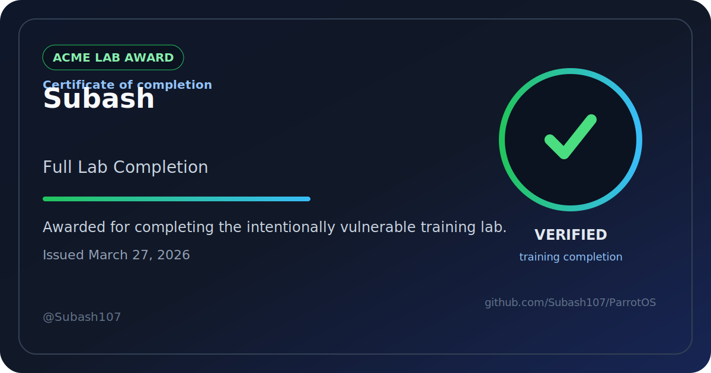

# Completion Award

- Recipient: `Subash`
- GitHub username: `@Subash107`
- Track: `Full Lab Completion`
- Issued on: `2026-03-27` (March 27, 2026)
- Badge file: [`../badges/subash-full-lab-completion-2026-03-27.svg`](../badges/subash-full-lab-completion-2026-03-27.svg)
- Certificate file: [`../certificates/subash-full-lab-completion-2026-03-27.html`](../certificates/subash-full-lab-completion-2026-03-27.html)
- Repository: https://github.com/Subash107/ParrotOSv1
- Workflow run: https://github.com/Subash107/ParrotOSv1/actions/runs/23615013517

## Evidence Summary

ompleted end-to-end lab setup, validation, reporting workflow, Windows testing path, release publishing, and repository migration to ParrotOSv1
